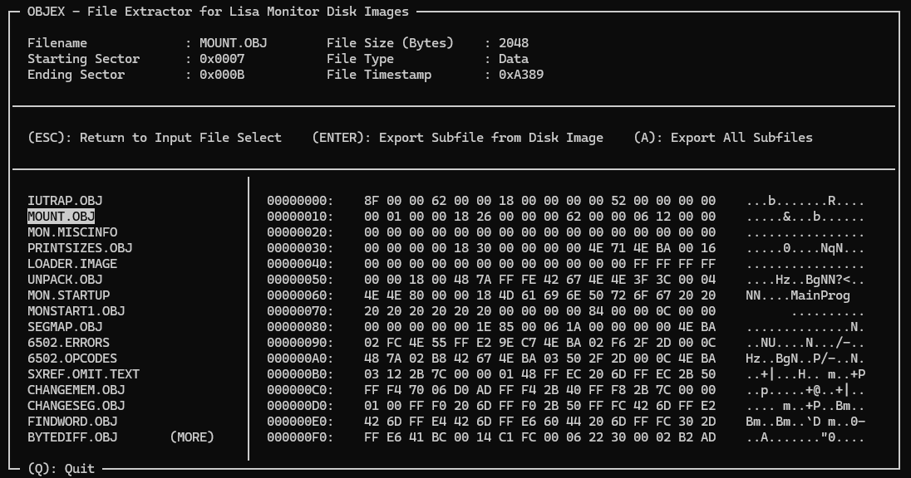

# OBJEX (Object File Extractor)
A utility for extracting files from Lisa Monitor disk images (raw DSK, not DC42). This is written in Pascal (FPC Pascal, specifically) and was partly an experiment in starting to learn Pascal that turned into more of an experiment in how to learn/use ncurses. As such, its code looks like absolute garbage; I'm not a programmer, I just know how to smash rocks together to make things work well enough.

## Requirements
This requires you to have the ncurses library installed for the menu system, which means this is Unix/Linux only, unfortunately. Additionally, this will require you to have FPC (Free Pascal) installed as well to compile.

## Use
Use is fairly straighforward - once you run the file, you'll be dropped into a file browser in whatever directory you ran the application from. Arrow keys will navigate you and enter/return will allow you to traverse the directory structure. Once you highlight a Lisa monitor raw (DSK/IMG) disk image, hit enter to drop into a pseudo-subdirectory with all of the files on the disk listed. Select a file and hit enter to dump it to the same dir as the disk image. You can also hit 'a' to dump all files from the image to the same directory. NOTE: This is non-functional by default and will require you to uncomment line 462 in O_MENUS.pas. Be advised, though, that dumping all will dump all files but immeidately crash the program and fault ncurses; this will break your current terminal session and require you to restart your terminal. I have been unable to find the cause of this, so it's disabled by default. Additionally, selecting any file other than a disk image will crash the program; I need to go back and add a file check at some point to prevent this.

## Notes
There are only probably a handful of people at most who would ever get any use out of this. I wrote it to help a friend dump some files off a Monitor disk and it quickly spiralled into something far dumber.

## License
As far as I'm concerned, this is in the public domain. It's absolute trash code and was, effectively, a self-imposed homework assignment. As usual, caveat utilitor - user beware - and know that you use this at your own risk; I am not responsibel for any terrible thing that comes with using this, up to and including the summoning of ancient Phoenician demons that possess you or your computer.